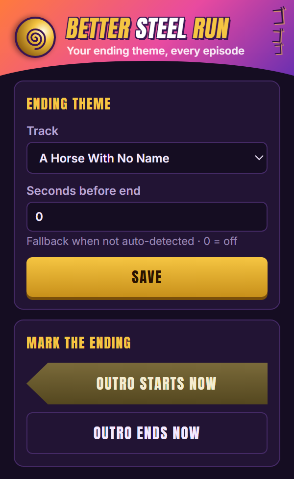
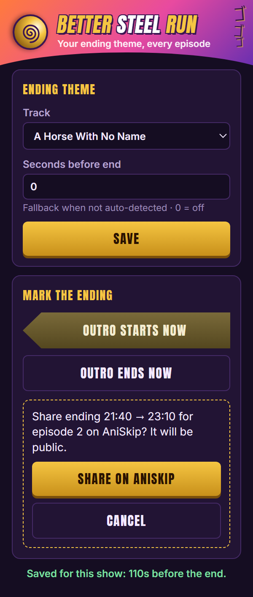

<p align="center">
  
</p>

<h1 align="center">Better Steel Run</h1>

<p align="center">
  <b>Swap the ending theme of <i>JoJo's Bizarre Adventure: Steel Ball Run</i> for the song of your choice, perfectly synced to the video.</b><br>
  A Chrome / Edge / Opera / Firefox extension (Manifest V3). No account, no tracking, no build step.
</p>

<p align="center">
  
  
  
  
</p>

---

When the ending of a *Steel Ball Run* episode starts, Better Steel Run mutes the player and plays your song instead: *A Horse With No Name*, *The Chain*, or any MP3 you pick. It follows the video exactly: pause, seek, change speed or volume, and the song stays in sync. When the ending is over (or you skip out of it), the original audio comes back.

## Screenshots

<p align="center">
  
  &nbsp;&nbsp;
  
</p>

## Features

- 🎵 **Your ending theme.** Upload any MP3 from your computer, or drop presets into `sounds/`.
- 🎯 **Finds the ending automatically.** Uses [AniSkip](https://aniskip.com)'s community-voted timestamps for the exact episode.
- ⏱️ **Frame-accurate sync.** Pause, seek, playback speed and volume all carry over to your song.
- 🏇 **"Outro starts now" button.** No AniSkip data yet? Press it once when the ending begins and it's remembered for the whole show.
- 🌐 **Share with everyone.** Press "Outro ends now" to submit the timestamps to AniSkip (after a confirmation), so every other viewer gets them too.
- 🛡️ **Ad-aware.** Ignores pre-roll ads and muted previews, and restores the original audio the moment you leave the ending.
- ゴゴゴ **Menacing UI.** Popup themed after *Steel Ball Run*, with a spinning steel ball and a *To Be Continued* arrow.

## Supported websites

The extension only acts on *Steel Ball Run* episodes, and leaves everything else alone.

| Site | Status |
|---|---|
| [Netflix](https://www.netflix.com) | 🟡 Should work, not tested yet (no AniSkip there: uses your "Outro starts now" mark or the popup fallback) |
| [Crunchyroll](https://www.crunchyroll.com) | ✅ Episode detection tested |
| 4anime (`4anime.com.ro`) | ✅ Tested end to end |
| Anikoto (`anikototv.to`) | ✅ Episode detection tested |
| AniZone (`anizone.to`) | ✅ Episode detection and playback tested |
| Re:Anime (`reanime.to`) | ✅ Episode detection tested |
| Miruro (`miruro.to` / `.bz` / `.cx` / `.tv`) | ✅ Episode detection tested |
| KickAssAnime (`kaa.to` / `.lt` / `.mx` / `.rs`) | ✅ Episode detection tested |
| Senshi (`senshi.to`) | ✅ Episode detection tested |
| Aniwave (`aniwaves.ru`) | ✅ Episode detection tested |
| Shiro (`shiro.so`) | ✅ Episode detection tested |
| AniSnatch (`anisnatch.to`) | ✅ Episode detection tested |
| AnimeX (`animex.one`) | ✅ Episode detection tested |
| MKissa (`mkissa.to`) | 🟡 Should work (behind a Cloudflare check during testing) |
| ani.pm | 🟡 Should work (not fully tested) |
| animepahe, Anime Nexus, AnimeOnsen, Anify, Bilibili | 🟡 Listed, not tested yet |

**Your site isn't here, or broke?** See [Contributing](#contributing). Adding a site is usually one line.

## Install

**From a store** (coming soon): Chrome Web Store · Edge Add-ons · Opera Add-ons · Firefox Add-ons. Open the popup, choose **Custom Local File**, upload your MP3 and hit **Save**. On Firefox, also click **Grant access** in the popup the first time.

**From source** (Chrome, Edge, Opera, Brave…):

1. **Download** this repo: click **Code → Download ZIP** and unzip it, or `git clone` it.
2. **Add your songs (optional).** Put MP3s in the `sounds/` folder named `horse.mp3` and `chain.mp3` to get them as presets in the popup. They're not included, because they're copyrighted recordings. Or skip this and use **Custom Local File**.
3. Open `chrome://extensions` (or `edge://extensions`) and turn on **Developer mode**.
4. Click **Load unpacked** and select the folder that contains `manifest.json`.
5. Pin **Better Steel Run** from the puzzle-piece menu, pick your track, and hit **Save**.

**From source on Firefox (140+):** open `about:debugging#/runtime/this-firefox` → **Load Temporary Add-on…** → pick `manifest.json`, then click **Grant access** in the popup. Temporary add-ons are removed when Firefox restarts.

## How it finds the ending

For each episode, the first source that has an answer wins:

1. **AniSkip.** The extension reads the show and episode number from the page, looks the show up on [AniList](https://anilist.co) to get its MyAnimeList ID, and fetches the community-voted ending timestamps from AniSkip.
2. **Your mark.** The time you saved with **Outro starts now** for this show.
3. **The popup fallback.** "Seconds before end" (0 = off).

Timestamps are measured from the *end* of the episode, so they still line up when a site's copy has a few extra seconds at the start.

## Privacy and permissions

Full policy: [PRIVACY.md](PRIVACY.md).

- **No accounts, no analytics.** Settings live in your browser's extension storage.
- **Network requests:** the show name goes to AniList, and the MyAnimeList ID and episode number go to AniSkip, only on *Steel Ball Run* pages.
- **Sharing is opt-in.** "Outro ends now" sends the start/end time, episode length, site name and a random anonymous ID to AniSkip only after you confirm. It's public data.
- **Why "all websites" access?** Streaming sites play video inside player frames whose domains change constantly. The script is injected everywhere so it can reach them, but it stays inactive unless the page you're on is a supported site *and* a *Steel Ball Run* episode.

## Contributing

Contributions are very welcome, especially **support for more websites**. The goal is for *Steel Ball Run* to have a better ending wherever people watch it.

**Add a website:**

1. Add its domain (and mirrors) to the `SITES` list at the top of [`content.js`](content.js).
2. Load the extension, open a *Steel Ball Run* episode on that site, and check the DevTools console on the **top** frame for:
   ```
   [Better Steel Run] Steel Ball Run: JoJo's Bizarre Adventure ep 2: AniSkip {…}
   ```
3. If the show name or episode number is wrong, add a small entry to `SITE_RULES` (see the Crunchyroll and ani.pm examples). It needs a `name`, `episode` or `anilistId` function.
4. Open a pull request with the site, what you tested, and a screenshot of the console line.

**Other ways to help:**

- 🐛 **Report a broken site:** open an issue with the episode URL and the console output.
- 🕒 **Submit timestamps:** use **Outro starts now** → **Outro ends now** → **Share on AniSkip** on episodes that don't have data yet.
- 🎨 **Improve the UI**, add translations, or suggest features.
- 📺 **Other shows?** The extension is locked to *Steel Ball Run* via `ONLY_SHOW` in `content.js`. If you'd like to make it configurable, a PR is welcome.

The project has no build step and no dependencies: plain JavaScript, HTML and CSS. Edit, reload the extension, refresh the tab.

**Maintainers:** `build.ps1` packages `dist/better-steel-run-<version>.zip` (the upload for all four stores), `store/render.ps1` regenerates the store images, and [`store/LISTING.md`](store/LISTING.md) has the listing text and permission justifications. Bump `version` in `manifest.json` before each store upload.

## Credits

- Ending timestamps: [AniSkip](https://aniskip.com). Please contribute timestamps back!
- Show lookup: [AniList](https://anilist.co) GraphQL API.
- *JoJo's Bizarre Adventure* is © Hirohiko Araki / LUCKY LAND COMMUNICATIONS / Shueisha / David Production. This is an unofficial fan project, not affiliated with or endorsed by them or any streaming site.

## License

[MIT](LICENSE). Songs are not included; bring your own.
